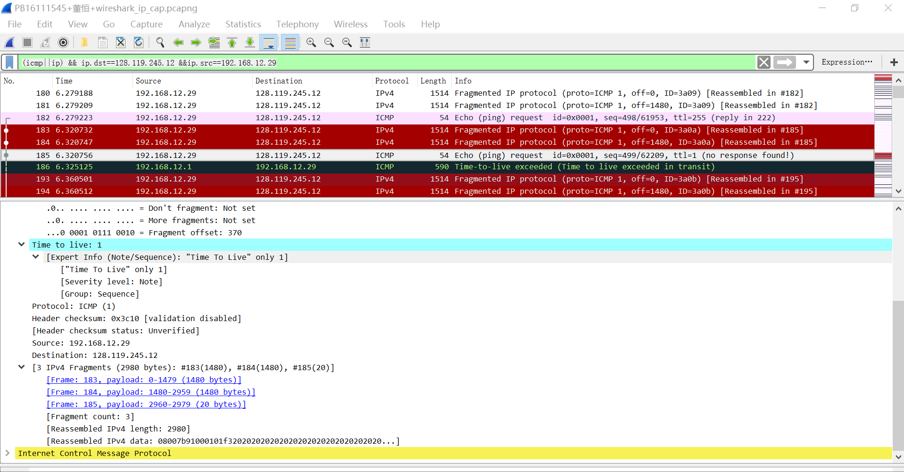
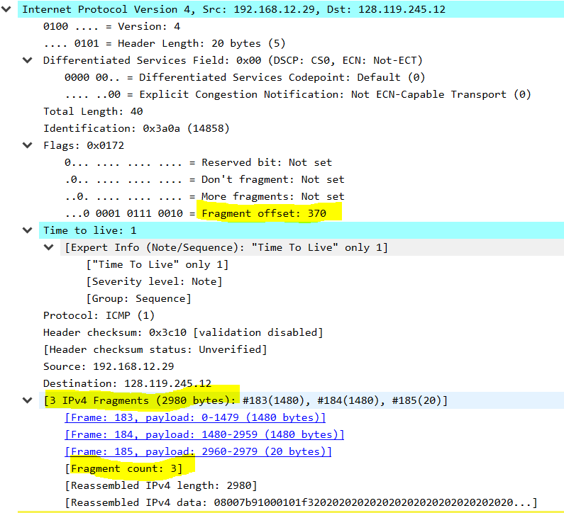

## 实验平台

win10,  wireshark, PingPlotter

由于这次需要用到PingPlotter.exe在linux上没有（虽然也有替代品），为了实验平台的一致性，转到win10做实验

## 实验内容

利用 wireshark 和 PingPlotter 观察网络层数据包

1. 下载并安装wireshark以及PingPlotter
2. 配置PingPlotter发包大小为3000Bytes
3. 启动wireshark
4. 启动PingPlotter追踪 gaia.cs.umass.edu，大约count值为3-4次时停止

## 结果分析

> 使用显示过滤器，过滤出本机到目的主机的所有IP和ICMP数据包

使用的过滤条件为

```
(icmp||ip) && ip.dst==128.119.245.12 &&ip.src==192.168.12.29
```



> 查找本机发送的第一个 TTL等于1 的 ICMP Echo Request 消息，请问此IP
> 数据报是否被分片（fragmented）？

查看info部分的`ttl`很容易找到找到`ttl=1`的部分。

点进去查看，就可以看到下面的fragment部分



> 打印出碎片IP数据报的第一个片段。IP 头中的哪些信息表明数据报已碎
> 片化？IP报头中的哪些信息表明这是第一个片段还是后一个片段？这个
> IP 数据报header有多少个字节？有效负载有多少个字节？


> 打印出碎片 IP 数据报的第二个片段。IP 报头中的哪些信息表明这不是第
> 一个数据报片段？是否还有更多的片段？2


> 从原始数据报创建了多少个片段？如何判断是最后一个片段？最后一个
> IP数据报负载有多少个字节？TTL的值？下层协议字段？2


